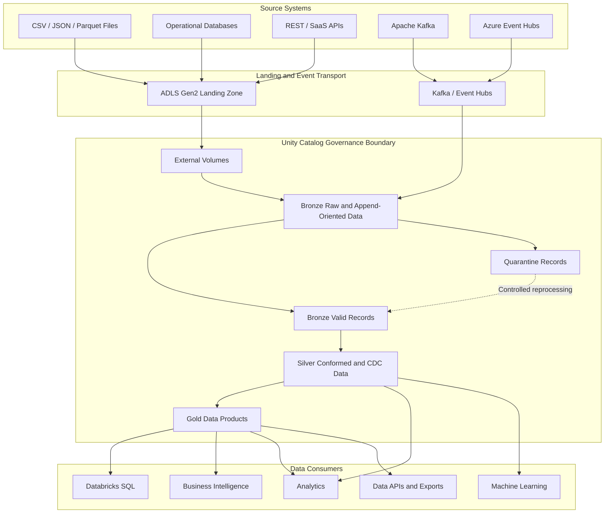
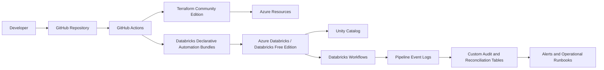
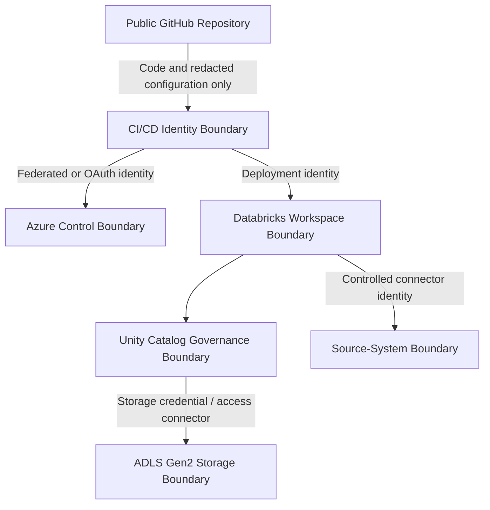

# Enterprise Azure Lakehouse Architecture

## 1. Purpose

This document defines the target architecture for the Enterprise Azure Lakehouse portfolio.

The repository is a production-inspired reference implementation designed to demonstrate modern data engineering principles using Azure Databricks, Delta Lake, Unity Catalog, Azure Data Lake Storage Gen2, metadata-driven ingestion, declarative data pipelines, Infrastructure as Code, CI/CD, testing, governance, and observability.

The implementation is intentionally designed for a single portfolio developer using a cost-conscious operating model. Enterprise capabilities that require paid cloud resources or centralized platform ownership may be represented through executable configuration, infrastructure definitions, automated tests, diagrams, and operational documentation.

> This portfolio demonstrates how the platform was designed and implemented in a portfolio environment. It does not claim that every included technology was used by the author in a production role.

---

## 2. Business Context

A retail organization receives customer, product, order, payment, shipment, and return data from multiple operational systems.

The source landscape includes:

- Batch files delivered to object storage
- Relational databases
- REST and SaaS APIs
- Change Data Capture feeds
- Apache Kafka events
- Azure Event Hubs events

The organization requires a governed Lakehouse platform that supports:

- Reliable batch and incremental ingestion
- Near-real-time event processing
- Source-history preservation
- Schema enforcement and evolution
- Data quality and quarantine
- CDC and dimensional processing
- Replay and backfill
- Source-to-target reconciliation
- Secure data access
- Automated deployment
- Operational monitoring
- Analytics and reporting

---

## 3. Architecture Goals

The architecture must provide:

1. **Source fidelity**
   Preserve sufficient source content and technical metadata to support troubleshooting, reconciliation, replay, and audit.

2. **Incremental processing**
   Process only new or changed data whenever the source and business requirement permit it.

3. **Idempotency**
   Reprocessing the same input must not produce uncontrolled duplicate business records or inconsistent target state.

4. **Replayability**
   Retained source data, deterministic transformations, and controlled checkpoints must support recovery and backfill.

5. **Separation of concerns**
   Ingestion, parsing, validation, business transformation, orchestration, infrastructure, and monitoring must have distinct responsibilities.

6. **Metadata-driven technical behavior**
   Repeated technical ingestion settings may be configuration-driven, while complex business logic remains explicit and code-reviewed.

7. **Governance by default**
   Data, files, tables, permissions, lineage, and ownership must be managed through Unity Catalog and controlled deployment processes.

8. **Observability by design**
   Pipeline health, freshness, quality, schema drift, reconciliation, and failures must be measurable.

9. **Secure defaults**
   The implementation must avoid embedded credentials and follow least-privilege access principles.

10. **Cost awareness**
    Batch, triggered processing, serverless capabilities, local execution, and limited cloud runtimes must be preferred when they satisfy the requirement.

11. **Testability**
    Parsers, validators, configuration readers, transformations, and data contracts must be testable independently.

12. **Operational simplicity**
    Native platform capabilities must be preferred over unnecessary custom frameworks.

---

## 4. Scope

### 4.1 Implemented in the portfolio

The repository will implement or provide executable definitions for:

- Repository and engineering standards
- Local Python development environment
- Metadata configuration models
- Control and audit models
- Sample retail-domain data
- File-based ingestion
- Bronze, Silver, and Gold processing
- Data quality and quarantine
- CDC and SCD patterns
- Replay and backfill utilities
- Reconciliation
- Unit and integration tests
- Declarative Automation Bundle definitions
- GitHub Actions validation
- Terraform infrastructure definitions
- Architecture and operational documentation

### 4.2 Enterprise capabilities simulated or selectively demonstrated

The following may be demonstrated through code, diagrams, configuration, tests, or limited free environments:

- Development, test, and production separation
- Azure workload identities
- Enterprise group-based access control
- Production approval workflows
- Central alerting
- Disaster-recovery procedures
- Large-scale performance configuration
- Kafka and Event Hubs production topology
- Organization-wide policy enforcement
- Centralized cost monitoring

### 4.3 Normally owned by a platform or cloud team

The following responsibilities are normally shared with or owned by a centralized platform team:

- Azure subscription and management-group governance
- Network topology and private connectivity
- Enterprise identity federation
- Production storage-account provisioning
- Production Databricks workspace provisioning
- Central Key Vault administration
- Organization-wide policies
- Enterprise monitoring integrations
- Secret-rotation infrastructure
- Production break-glass access
- Disaster-recovery infrastructure

---

## 5. Logical Data Architecture



---

## 6. Supporting Platform Architecture



---

## 7. Architecture Planes

| Plane | Responsibility | Primary Components |
|---|---|---|
| Data plane | Moves, stores, and transforms business data | ADLS Gen2, Kafka, Event Hubs, Delta tables, streaming tables, materialized views |
| Control plane | Coordinates executions and deployment behavior | Databricks Workflows, Declarative Automation Bundles, pipeline parameters, control tables |
| Governance plane | Governs data ownership, discovery, lineage, and privileges | Unity Catalog, catalogs, schemas, volumes, tables, views, groups, grants |
| Observability plane | Measures reliability, quality, freshness, reconciliation, and failures | Pipeline event logs, audit tables, DQ results, reconciliation results, dashboards, alerts |
| Security plane | Controls identities, credentials, trust boundaries, and least privilege | Microsoft Entra ID, managed identities, service principals, workload identity, Key Vault |
| CI/CD plane | Validates, packages, reviews, and promotes changes | GitHub, GitHub Actions, Terraform, Bundles, branch protection, approvals |

---

## 8. Data-Layer Responsibilities

| Layer | Primary responsibility | Prohibited or discouraged behavior |
|---|---|---|
| Landing | Preserve source-delivered files or extracts with minimal modification | Business transformations and destructive rewriting |
| Bronze | Preserve raw history and technical ingestion metadata | Complex business rules and consumer-facing modeling |
| Quarantine | Retain failed records with rule and reprocessing context | Silent deletion of invalid data |
| Silver | Parse, standardize, deduplicate, conform, apply CDC, and enforce trusted rules | Dashboard-specific aggregation and uncontrolled raw payload use |
| Gold | Publish facts, dimensions, aggregates, metrics, and consumer-ready data products | Source-specific technical parsing |

---

## 9. Processing Patterns

The platform supports multiple ingestion patterns without forcing them into a single universal engine.

### 9.1 File ingestion

```text
Source File
    ↓
ADLS Gen2 Landing
    ↓
Unity Catalog External Volume
    ↓
Auto Loader
    ↓
Bronze
    ↓
Data Quality and Quarantine
    ↓
Silver
    ↓
Gold
```

### 9.2 Event-stream ingestion

```text
Event Producer
    ↓
Kafka or Azure Event Hubs
    ↓
Structured Streaming
    ↓
Bronze Append-Oriented Event History
    ↓
Schema Validation and Quarantine
    ↓
Silver CDC or Conformed State
    ↓
Gold Incremental Aggregates
```

### 9.3 Direct source ingestion

```text
Operational Source
    ↓
Controlled JDBC, API, CDC, or Managed Connector
    ↓
Landing or Bronze
    ↓
Silver
    ↓
Gold
```

Direct source access is used only when source protection, extraction consistency, deletion handling, retry behavior, and reconciliation have been addressed.

---

## 10. Metadata-Driven Design Boundary

Configuration is used for repeatable technical behavior such as:

- Source identifiers
- File formats and paths
- Target object names
- Schema references
- Ingestion modes
- Watermark columns
- CDC sequence columns
- Operation columns
- Trigger settings
- Retry policies
- Data-quality rule references
- Notification routing

Explicit code is retained for:

- Complex business transformations
- Business-specific survivorship
- Dimensional modeling
- Non-trivial CDC decisions
- Cross-domain logic
- Financial calculations
- Consumer-specific semantic logic

This boundary prevents the repository from becoming an opaque universal framework that is difficult to test, review, and operate.

---

## 11. Environment Model

The logical environments are:

```text
Development
    ↓
Test / UAT
    ↓
Production
```

The portfolio represents each environment through configuration, deployment targets, permissions, naming, and documentation.

The target enterprise recommendation is:

- Separate workspaces for development and production
- Separate catalogs per environment
- Separate storage boundaries for production
- Identity-based access
- Environment-specific deployment identities
- Production deployment approval
- No direct developer writes to production-managed objects

A single free or low-cost workspace may be used for portfolio execution, but the design must preserve environment separation logically.

---

## 12. Security Boundaries



The public repository must never contain:

- Access tokens
- Passwords
- Client secrets
- Storage keys
- Connection strings
- Private tenant identifiers
- Customer data
- Production URLs
- Personal email addresses
- Unredacted screenshots

---

## 13. Reliability Model

The architecture uses the following reliability controls:

- Append-oriented Bronze history
- Checkpointed incremental processing
- Deterministic deduplication
- Watermark commitment after successful processing
- Quarantine instead of silent record loss
- Schema-drift capture
- Source-to-target reconciliation
- Idempotent merge and CDC behavior
- Controlled replay boundaries
- Backfill request tracking
- Retry classification
- Runbooks for non-retryable failures
- Git commit and deployment-version traceability

Native Databricks pipeline state, checkpoints, and event logs are used where they already solve the requirement. Custom tables are introduced only for business reconciliation, cross-pipeline operations, or metrics not adequately represented by native state.

---

## 14. Cost-Conscious Operating Model

The portfolio follows these cost controls:

- Use GitHub and local tooling for documentation, validation, and unit testing.
- Use Databricks Free Edition where supported.
- Use local Spark only for transformations that can be tested reliably outside managed Databricks capabilities.
- Prefer synthetic test data over large cloud-hosted datasets.
- Prefer triggered execution over continuously running compute.
- Create paid Azure resources only for bounded demonstrations.
- Apply resource tags, budgets, alerts, and automated cleanup before cloud deployment.
- Avoid leaving compute, Event Hubs, databases, or integration services running unnecessarily.
- Represent unsupported enterprise capabilities through Infrastructure as Code and documentation rather than pretending they were executed.

---

## 15. Major Technology Decisions

| Decision area | Selected approach | Reason |
|---|---|---|
| Governance | Unity Catalog | Centralized governance for tables, files, lineage, ownership, and permissions |
| File access | Unity Catalog volumes | Governed file access without legacy DBFS mounts |
| Table format | Delta Lake | Transactional storage, schema enforcement, time travel, and incremental patterns |
| File ingestion | Auto Loader | Scalable file discovery, schema handling, and incremental ingestion |
| Pipeline model | Lakeflow Spark Declarative Pipelines where appropriate | Managed dependency graph, expectations, and event-log integration |
| Orchestration | Databricks Workflows for Databricks-native execution | Avoid unnecessary external orchestration |
| External orchestration | Airflow only for cross-platform workflow demonstrations | Use it where orchestration crosses system boundaries |
| Infrastructure | Terraform Community Edition | Reproducible Infrastructure as Code without requiring paid Terraform services |
| Deployment | Declarative Automation Bundles | Environment-aware packaging and Databricks resource deployment |
| CI/CD | GitHub Actions | Native alignment with the public GitHub portfolio |
| Configuration | Metadata-driven technical behavior | Reuse repeatable ingestion behavior without hiding business logic |
| Documentation | Markdown, Mermaid, and Architecture Decision Records | Version-controlled documentation as code |

---

## 16. Explicit Non-Goals

The platform will not:

- Build one universal ingestion engine for every source type.
- Use streaming when batch processing meets the requirement.
- Store real credentials in Git.
- Recommend DBFS mounts.
- Put complex business logic into configuration tables.
- Duplicate every native Databricks operational metric in custom audit tables.
- Create unnecessary classes, wrappers, or generic utility modules.
- Claim production scale based only on synthetic portfolio workloads.
- Deploy expensive cloud resources merely to make the repository appear enterprise-grade.
- Treat every Medallion object as a streaming table by default.

---

## 17. Definition of Done for the Architecture

This architecture is considered implemented when:

- The repository structure maps clearly to the documented architecture.
- Every component has a defined responsibility and owner.
- Environment configuration is separated.
- Infrastructure and Databricks resources are deployable through code where supported.
- The file-ingestion project runs end to end.
- Data-quality failures are visible and recoverable.
- Silver processing is deterministic and incremental.
- Gold data products are documented and testable.
- CI validates code, configuration, SQL, and deployment definitions.
- Security-sensitive values are excluded from the repository.
- Monitoring and reconciliation evidence is documented.
- Replay and backfill procedures are executable.
- The project can be explained accurately in a technical interview.
